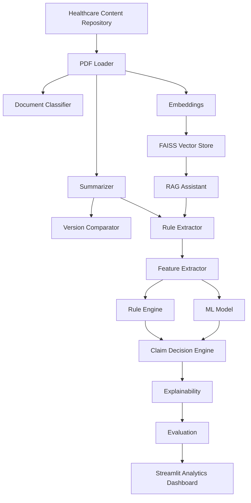

# Healthcare Content Intelligence Platform

An AI-powered Streamlit application for healthcare content intelligence, policy analysis, RAG-based question answering, rule extraction, feature extraction, claim decision support, explainability, and AI quality evaluation.

The project is designed as an enterprise-style proof of concept for healthcare payment integrity and content management workflows.

## Capabilities

- Upload and parse healthcare PDF policies with PyMuPDF.
- Classify documents into billing, clinical, contract, coverage, regulatory, or unknown categories.
- Generate structured healthcare policy summaries.
- Compare policy versions and identify meaningful clinical, billing, coding, and contract changes.
- Generate embeddings with sentence-transformers and query policy content through FAISS-backed RAG.
- Extract executable JSON business rules and model-ready healthcare features.
- Execute rule-based evaluations against claim features.
- Train a lightweight Scikit-learn claim prediction model with synthetic data.
- Combine rules, ML predictions, and features into final claim decisions.
- Generate auditable explanations and evaluate AI output quality.

## Architecture



## Project Structure

```text
app.py                 Streamlit entry point
pages/                 Multi-page Streamlit workflow
components/            Reusable UI components
utils/                 Session state, theme, and helper utilities
config/                Frontend configuration
modules/               Healthcare AI backend modules
prompts/               Optional external prompt templates
tests/                 Unit tests
docs/                  Architecture and supporting documentation
data/                  Local source and generated data artifacts
logs/                  Runtime logs
output/                Exported reports and generated outputs
```

> Note: The repository also contains an earlier `src/` and `app/` scaffold. The active Phase 5 application uses root-level `app.py`, `pages/`, `components/`, `utils/`, `config/`, and `modules/`.

## Setup

```powershell
python -m venv .venv
.\.venv\Scripts\Activate.ps1
pip install -r requirements.txt
Copy-Item .env.example .env
```

Add your Groq key to `.env` if you want to use Groq-backed policy summarization. OpenAI remains available for the other backend modules that still use it.

## Run

```powershell
streamlit run app.py
```

Then open:

```text
http://localhost:8501
```

## Deploy on Render

This repository now includes [render.yaml](C:\Users\Nihil Rengasamy\Documents\Codex\2026-06-27\hi\outputs\healthcare-content-intelligence\render.yaml) for a free Render web service.

Start command used by Render:

```text
streamlit run app.py --server.port $PORT --server.address 0.0.0.0 --server.headless true
```

Before deploying, add these environment variables in Render:

- `GROQ_API_KEY`
- `OPENAI_API_KEY` if you want the OpenAI-backed modules enabled
- Any custom model overrides you want to use from `.env.example`

Render deploy flow:

1. Push this folder to a GitHub repository.
2. In Render, choose `New +` -> `Blueprint`.
3. Select the GitHub repository.
4. Render will detect `render.yaml` and create the web service.

## Test

```powershell
python -m compileall -q app.py modules pages components utils config
python -m pytest
```

Unit tests mock external LLM behavior and should not call any external LLM API.

## Security Notes

- Keep `.env` and Streamlit secrets out of source control.
- Treat saved pickle, FAISS, and joblib artifacts as trusted local files only.
- Do not upload production PHI or real claims without a privacy and security review.
- The app is a proof of concept and does not implement authentication, authorization, or HIPAA-grade deployment controls.

## Main Modules

- `pdf_loader.py`: PDF ingestion, metadata extraction, and chunking.
- `document_classifier.py`: Healthcare document classification with deterministic fallback.
- `summarizer.py`: Structured healthcare content summarization.
- `compare_versions.py`: Policy version comparison and change reporting.
- `embeddings.py`: Sentence-transformer embedding generation.
- `vector_store.py`: FAISS vector index creation, persistence, and search.
- `rag.py`: Retrieval-augmented policy question answering.
- `rule_extractor.py`: LLM-assisted JSON business rule extraction.
- `feature_extractor.py`: Structured healthcare feature extraction.
- `rule_engine.py`: Deterministic rule execution.
- `ml_model.py`: Lightweight claim prediction model.
- `claim_decision.py`: Hybrid rule and ML claim decision support.
- `explainability.py`: Human-readable explanations and audit trails.
- `prompt_manager.py`: Centralized prompt loading and formatting.
- `evaluation.py`: AI quality, groundedness, hallucination, and pipeline evaluation.

## Status

Phase 5 review-ready proof of concept. The architecture is intentionally modular so each backend component can be explained independently in an interview while the Streamlit app demonstrates the complete end-to-end workflow.
